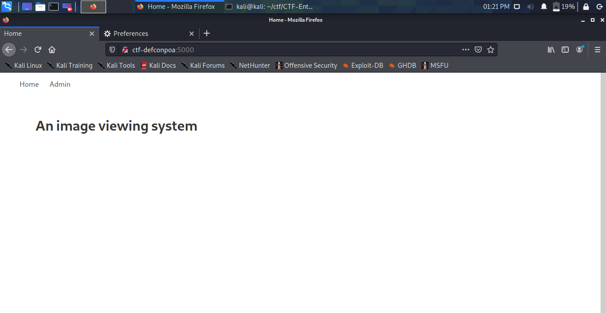
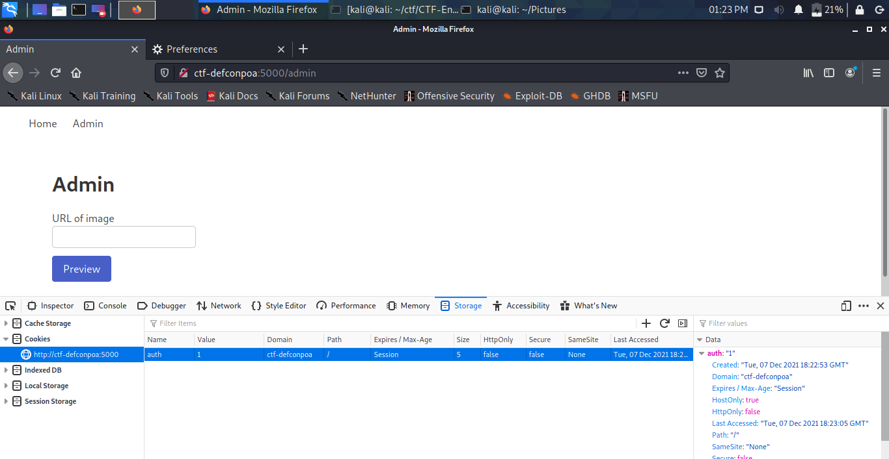
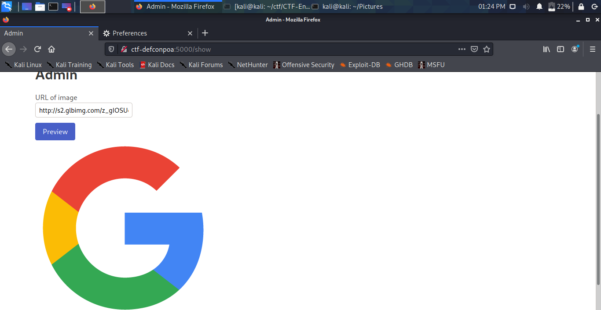
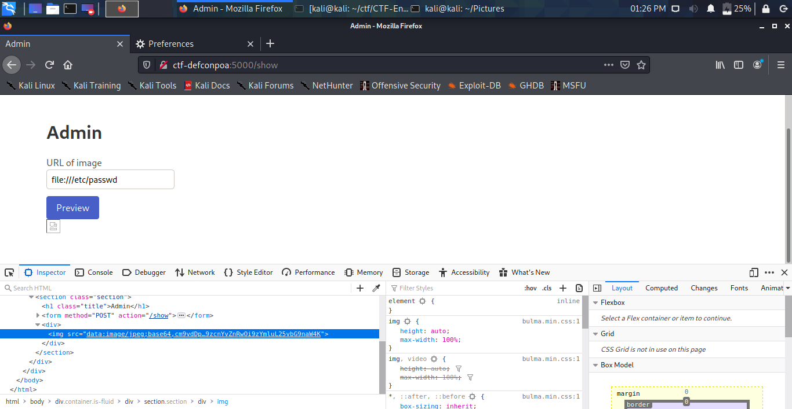
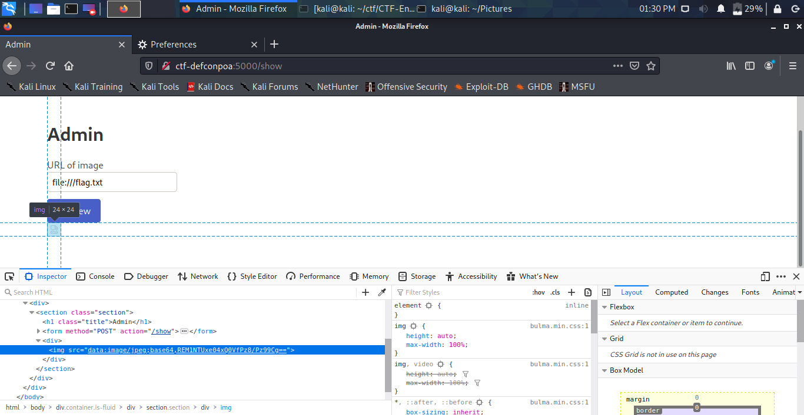

# Preview
### _WEB_

Nos deparamos com a seguinte página ao acessar o desafio:


Clicando em "Admin", somos enviados para "/admin" porém a mesma página a cima é renderizada. Olhando os cookies é possível verificar o seguinte:

```
auth=0
```

Alterando o auth para 1, temos acesso ao "/admin":


Que é nada mais que um "sistema de renderização de imagens". Passando uma url de uma imagem qualquer, ela é renderizada:


Sendo assim, imagina-se que exista alguma função que acesse a url, baixe o conteúdo do arquivo em questão (a imagem) e faça a "renderização" dessa imagem. Portanto, usando o protocolo file (```file://```) é possível fazer com que a função acesse algum arquivo interno do servidor.


Então, procurando por "/flag.txt" temos a flag:


FLAG:
```
DC5551{N1CE_?????}
```
