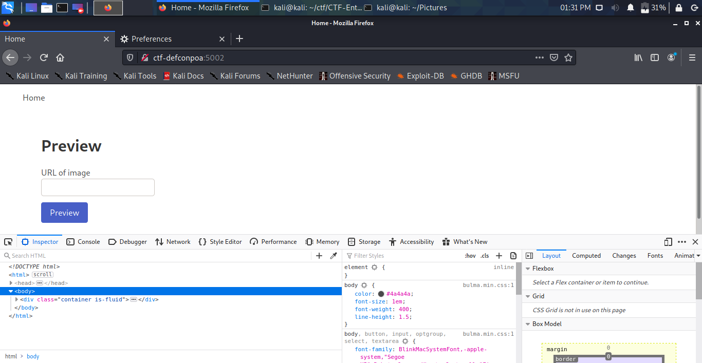
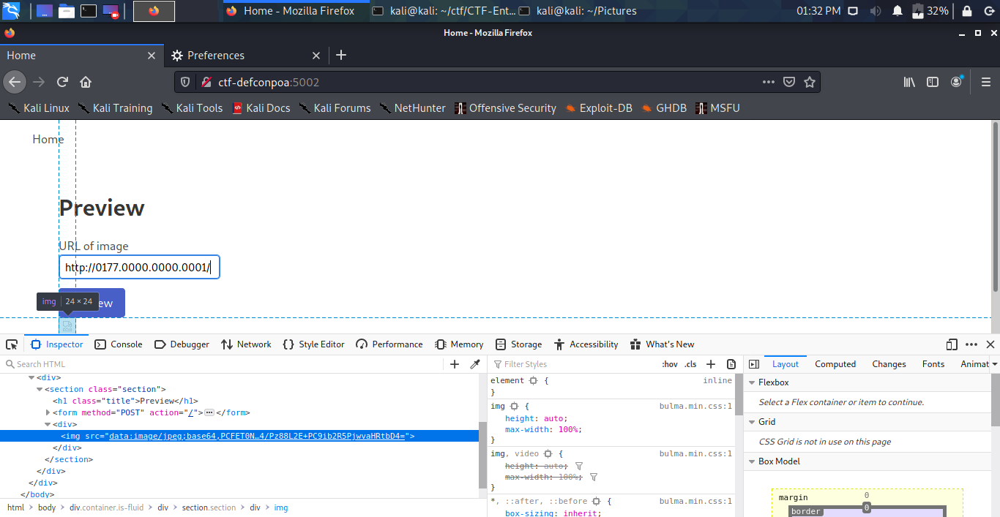

# Simple Request
### _WEB_

Ao acessar o desafio, nos deparamos com a seguinte página:


Ao tentar o mesmo payload do desafio Preview?, não acontece nada. Então, lendo a descrição do desafio:

>Ainda no sistema de visualização, o desenvolvedor agora adicionou alguns filtros. Mas o mais estranho é que agora há um serviço rodando em outra porta. Você consegue pegar a flag?

Por isso, podemos ter em mente que existe um possível SSRF. Porém, usando ```http://0.0.0.0/```, ```http://127.0.0.1/```, ```http://localhost/``` não retorna nenhum resultado. Uma das formas é tentar uma codificação para o endereço IP, no caso usaremos a codificação Octal (link - https://www.browserling.com/tools/ip-to-oct)

Utilizando ```http://0177.0000.0000.0001/``` recebemos a seguinte resposta:

>resposta

E para a flag, usamos ```http://0177.0000.0000.0001/flag```:
```DC5551{???_ssRF!1}```
