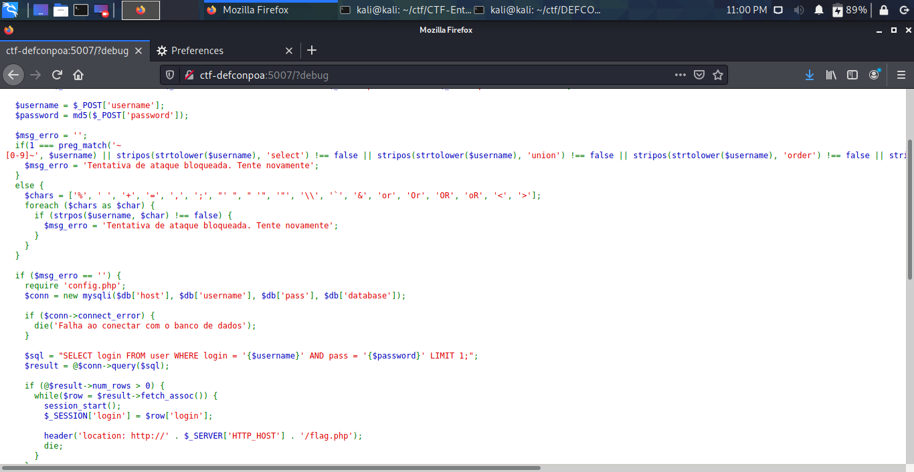

# SQL2

Acessando o desafio, no HTML da página encontramos o comentário ```?debug```. Ao passar esse parâmetro, temos acesso ao código fonte aplicação.


Lendo o código por completo, é possível ver que precisamos explorar um SQL Injection porém burlando alguns filtros.

Como o password é encriptado, não há como utilizá-lo para a injecão de SQL.
Os filtros utilizados dificultam bastante pensar em um payload para exfiltrar dados, então o payload mais fácil de ser deduzido é o seguinte:
```any_user'#```

Pois ' e # não estão sendo filtrados e any_user podemos "chutar". E esse payload encaixa perfeitamente na query utilizada:
```$sql = "SELECT login FROM user WHERE login = 'any_user'# AND pass = '{$password}' LIMIT 1;";```

Tudo a partir do # será considerado como comentário. Então só nos resta "chutar" o user. O chute mais lógico seria: admin.
Payload: ```admin'#```

```DC5551{Sql_1nj3ct10n_c0nclu1d0_947}```
